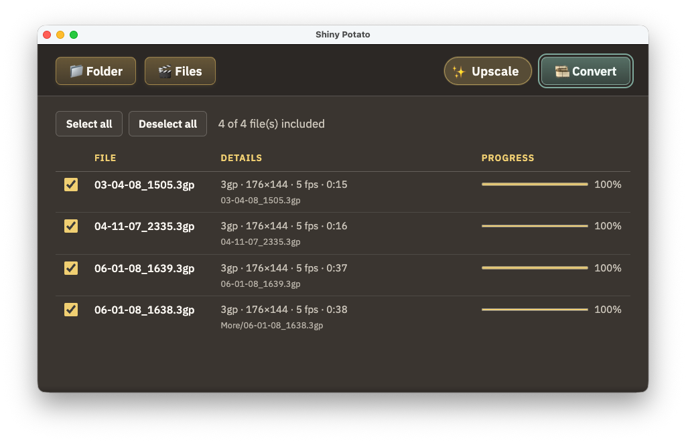

# Shiny Potato


**A desktop app that polishes legacy video into modern MP4—without turning your weekend into a command-line film festival.** 🥔✨

> **TL;DR** — Drag in dusty files, get shiny MP4s. No film degree required.

Shiny Potato is a small [Electron](https://www.electronjs.org/) utility for macOS, Windows, and Linux. Point it at a folder or a hand-picked set of files; it scans for older formats, shows codecs and details, and converts the queue to **H.264 + AAC** in **MP4** using bundled [FFmpeg](https://ffmpeg.org/). Optional **upscale** applies denoise, sharpen, and gentle resolution bumps (720p / 1080p tiers) when you want the picture a little less… historical.



---

## What you get 🎬

- **Folder or file mode** — Recursive folder scan or multi-file selection from the system dialog. 📁
- **Legacy-aware list** — File name, technical details (codec, resolution, frame rate, duration where available), per-row progress during conversion. 📋
- **Batch conversion** — One output folder; overall progress when multiple files are queued. 🎞️
- **Upscale toggle** — Optional enhancement pass before encode (off when you want speed over sparkle). ✨
- **Sensible defaults** — Software encode via `libx264`, AAC audio, fast-start MP4 for streaming-friendly playback. ⚙️
- **Native touches** — About panel with credits; menu bar entries on macOS; Help → About on Windows and Linux. 🪟🍎🐧

---

## Requirements 📋

- **Node.js** 18 or newer
- **npm** (or compatible client) for install and scripts

FFmpeg and FFprobe are pulled in as dependencies (`ffmpeg-static`, `ffprobe-static`); you do not need them installed globally unless you prefer to wire a custom binary later.

---

## Getting started 🚀

After you **clone** the repository, run **`npm install` once** from the project root before using any npm scripts. Dependencies are installed into `node_modules/` and are not checked into git, so a fresh clone will not run until you install them.

```bash
git clone https://github.com/rubit0/Shiny-Potato.git
cd Shiny-Potato
npm install
npm start
```

For extra logging during development:

```bash
npm run start:dev
```

---

## Scripts 🧰

| Command             | Description                                                                             |
| ------------------- | --------------------------------------------------------------------------------------- |
| `npm start`         | Run the app from source (Electron).                                                     |
| `npm run start:dev` | Same, with `--enable-logging`.                                                          |
| `npm run pack:mac`  | Package a **macOS** `.app` into `release/` (uses `resources/icon` for the bundle icon). |
| `npm run pack:win`  | Package a **Windows** app into `release/` (see [Building 📦](#building) below).         |

---

## Building 📦

Packaging uses [electron-packager](https://github.com/electron/packager). Run these from the project root after `npm install`. Outputs land under `release/` (ignored by git).

### macOS 🍎

```bash
npm run pack:mac
```

You’ll get a folder such as `release/Shiny Potato-darwin-arm64/` (or `darwin-x64`, depending on your Mac) containing **Shiny Potato.app**.

### Windows 🪟

```bash
npm run pack:win
```

You’ll get a folder such as `release/Shiny Potato-win32-x64/` containing **Shiny Potato.exe** and supporting files. You can run this command from **Windows**, **macOS**, or **Linux**—Electron packager can cross-build the Windows target from other OSes.

**Optional:** For a branded `.exe` icon, add a **`resources/icon.ico`** file and extend the `pack:win` script with `--icon=resources/icon.ico` (Windows expects `.ico` for the installer/shortcut look; PNG/ICNS alone are not used the same way).

**Optional:** Target a specific architecture, e.g. ARM64:

```bash
npx electron-packager . "Shiny Potato" --platform=win32 --arch=arm64 --overwrite --out=release --ignore="^/release($|/)" --ignore="^/dist($|/)" --ignore="^/out($|/)"
```

### Linux 🐧

There is no npm script yet, but the same pattern applies:

```bash
npx electron-packager . "Shiny Potato" --platform=linux --overwrite --out=release --ignore="^/release($|/)" --ignore="^/dist($|/)" --ignore="^/out($|/)"
```

---

## Supported source extensions 📼

The scanner treats these as candidate legacy video inputs: **3GP, AMR, MP4, M4V, AVI, WMV, MOV, FLV, MPG, MPEG**. (Some MP4s are probed further—older codecs inside a modern container still count as “legacy” for this workflow.)

---

## Acknowledgments 🙏

Built with Electron and FFmpeg. Thanks to the maintainers of those projects and of the static binaries that keep installs predictable across machines.

---

## Author 👤

**Ruben de la Torre**

---

_May your bitrates be stable and your aspect ratios honored._ 🎬
